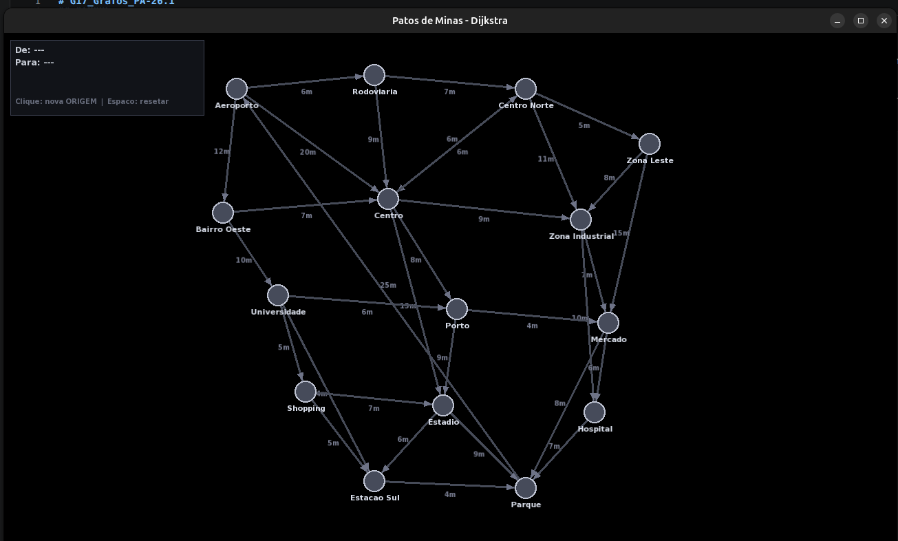
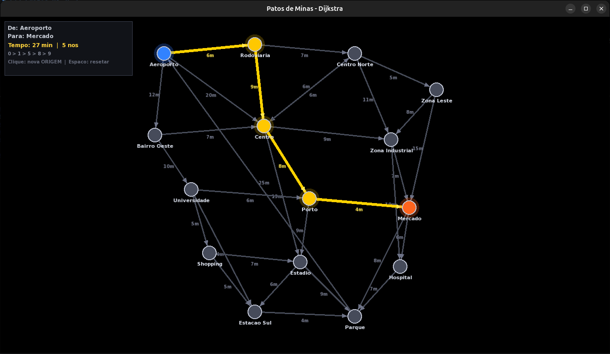
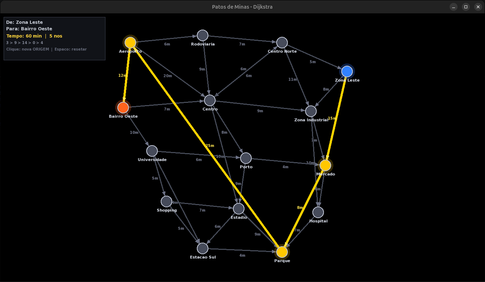

# G17_Grafos_PA-26.1

## City Pathfinder

Conteúdo da Disciplina: Grafos 1

## Alunos
|Matrícula | Aluno |
| -- | -- |
| 23/1011515  | [Isaque Camargos Nascimento](https://github.com/isaqzin) |
| 23/1026750 | [Ludmila Aysha Oliveira Nunes](https://github.com/ludmilaaysha) |

## Sobre 

Projeto desenvolvido para a disciplina **Projeto de Algoritmos** da Universidade de Brasília (UnB), ministrada pelo professor Maurício Serrano, no semestre 2026.1.

Este trabalho faz parte do Módulo 1 da disciplina (**Grafos**) e consiste na implementação do Algoritmo de Dijkstra com uma *heap* mínima a um problema de encontrar o trajeto com menor custo entre dois pontos de uma cidade.

Além da implementação do algoritmo, o projeto também conta com uma visualização gráfica interativa, que permite ilustrar a ideia do algoritmo em uma implementação real, semelhante ao que ocorre em aplicativos de navegação (como GPS), em que o usuário pode escolher origem e destino e receber a melhor rota.

### Como funciona o algoritmo?

O algoritmo de Dijkstra resolve o problema de caminho mínimo em grafos ponderados com pesos não negativos. Sua ideia central consiste em:

1. Iniciando no ponto de origem, selecionar o nó com menor custo acumulado
2. Incluir e atualizar as distâncias dos seus vizinhos na *heap*
3. Repetir até alcançar o destino, sempre escolhendo as arestas de menor custo acumulado por meio da *heap*

O uso da *min-heap* para definir o próximo nó a ser selecionado fornece operações mais baratas, pois:

- Inserção: $O(log n)$
- Remoção do menor elemento: $O(log n)$

Isso melhora a complexidade do Dijkstra para:

$$𝑂((𝑉+𝐸)log⁡𝑉)$$

Em que $V$ é a quantidade de vértices e $E$ a quantidade de arestas. 

## Screenshots

O projeto inicia desta forma: 


Esta é a execução do caminho aeroporto para o mercado:


Esta é a execução do caminho da zona leste para o bairro oeste:


## Instalação 
Linguagem: C++<br>
Framework: SFML<br>
Descreva os pré-requisitos para rodar o seu projeto e os comandos necessários.

A linguagem C++ foi escolhida porque os integrantes do grupo desejavam se aprofundar nela, especialmente com foco na disciplina de Programação Competitiva.

Já a biblioteca SFML foi utilizada para a parte gráfica por ser fácil de usar, leve e permitir criar interfaces visuais de forma simples.

### Linux

#### Instale dependências

```bash
sudo apt install build-essential libsfml-dev
```

#### Compile o projeto e execute

```bash
g++ main.cpp -o main -lsfml-graphics -lsfml-window -lsfml-system
./main
```

## Uso 

Para utilizar o programa, selecione dois nós com o mouse: primeiro a origem e depois o destino. Em seguida, o sistema calculará e exibirá o melhor caminho entre eles, destacado em amarelo.

No canto superior esquerdo, há um painel onde é possível visualizar o número de nós presentes no caminho, além de outras informações.

Ao pressionar a tecla Espaço, o caminho é limpo.